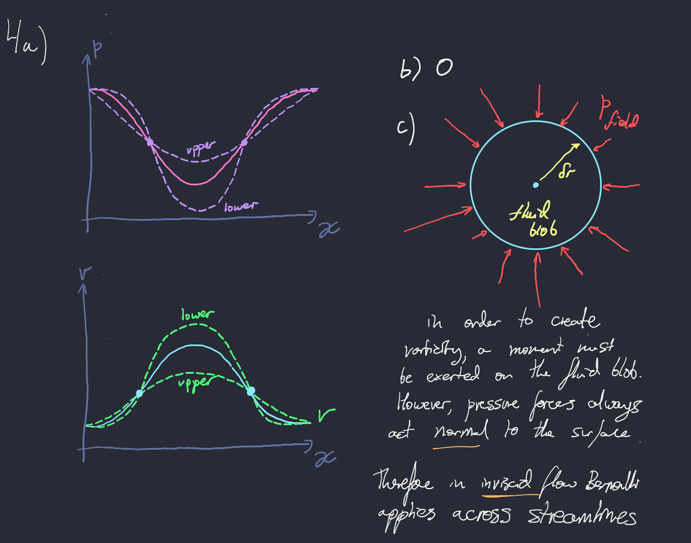

# Dracula for [Xournal++](https://xournalpp.github.io)

> A dark theme for [Xournal++](https://xournalpp.github.io).

## Install

All instructions can be found at [draculatheme.com/xournalpp](https://draculatheme.com/xournalpp).

## Team

This theme is maintained by the following person(s) and a bunch of [awesome contributors](https://github.com/dracula/xournalpp/graphs/contributors).

 |
--- |
[Tim Clifford](https://github.com/tim-clifford) |

## License

[MIT License](./LICENSE)
